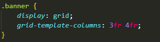

<h1 align="center">:triangular_ruler: Landing Page Marvel - Eternals</h1>

# :memo: Índice
* [:chart_with_upwards_trend: Proposta](https://github.com/rodrigobarros2802/landingpage-eternals-responsive#chart_with_upwards_trend-proposta)
* [:trophy: Desafio](https://github.com/rodrigobarros2802/landingpage-eternals-responsive#trophy-desafio)
* [:hammer_and_wrench: Tecnologias](https://github.com/rodrigobarros2802/landingpage-eternals-responsive#hammer_and_wrench-tecnologias)
* [:dart: Objetivo](https://github.com/rodrigobarros2802/landingpage-eternals-responsive#dart-objetivo)
* [:open_book: Aprendizado](https://github.com/rodrigobarros2802/landingpage-eternals-responsive#open_book-aprendizado)
* [:camera: Imagens do Projeto](https://github.com/rodrigobarros2802/landingpage-eternals-responsive#camera-imagens-do-projeto)
* 1. [:iphone: :computer: :desktop_computer:Responsividade](https://github.com/rodrigobarros2802/landingpage-eternals-responsive/edit/master/README.md#responsividade-iphone-computer-desktop_computer)
* 2. [:movie_camera: Vídeo Apresentação do Projeto](https://github.com/rodrigobarros2802/landingpage-eternals-responsive/edit/master/README.md#movie_camera-v%C3%ADdeo-apresenta%C3%A7%C3%A3o-do-projeto)
* 3. [:iphone: Mobile](https://github.com/rodrigobarros2802/landingpage-eternals-responsive/edit/master/README.md#iphone-mobile)
* 4. [:computer: Tablet](https://github.com/rodrigobarros2802/landingpage-eternals-responsive/edit/master/README.md#computer-tablet)
* 5. [:desktop_computer: Desktop / Notebook](https://github.com/rodrigobarros2802/landingpage-eternals-responsive/edit/master/README.md#desktop_computer-desktop--notebook)
* [:link: Links](https://github.com/rodrigobarros2802/landingpage-eternals-responsive#link-links)
* [:technologist: Autor](https://github.com/rodrigobarros2802/landingpage-eternals-responsive#technologist-autor)

<h1 align="center">:chart_with_upwards_trend: Proposta</h1>

<h1 align="center">:trophy: Desafio</h1>

<h1 align="center">:hammer_and_wrench: Tecnologias</h1>

<strong>JavaScript</strong>

<strong>HTML 5</strong>

<strong>CSS3</strong>

<h1 align="center">:dart: Objetivo</h1>

Usar a propriedade Flexbox Grid

Tornar responsivo para todos os dispositivos móveis

<h1 align="center">:open_book: Aprendizado</h1>

Aprendi nesse projeto a dispor da propriedade Grid e suas frações divindo o layout.

<h1 align="center">:camera: Imagens do Projeto</h1>
<h1 align="center">Responsividade :iphone: :computer: :desktop_computer:</h1>

<h1 align="center">:movie_camera: Vídeo Apresentação do Projeto</h1>

<h1 align="center">:iphone: Mobile</h1>

<h1 align="center">:computer: Tablet</h1>

<h1 align="center">:desktop_computer: Desktop / Notebook</h1>

<h1 align="center">:link: Link Deploy</h1>

Deploy - https://tangerine-croquembouche-4724e4.netlify.app/
 

<h1 align="center">:technologist: Autor</h1>

LinkedIn - https://www.linkedin.com/in/rodrigobarros2802/

GitHub - https://github.com/rodrigobarros2802
 
